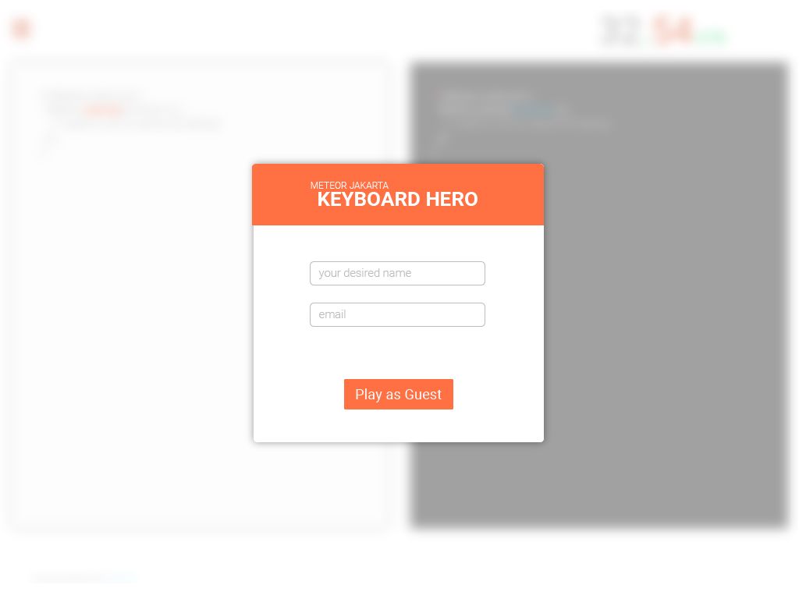
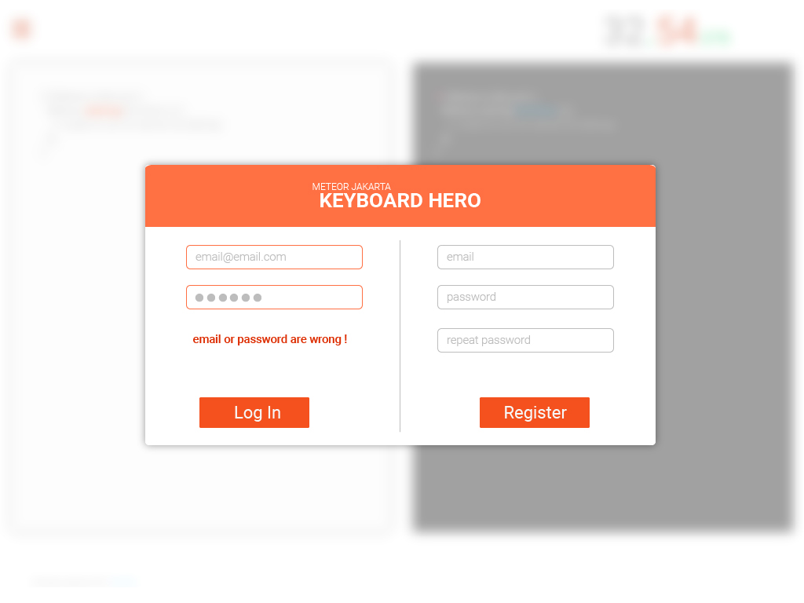
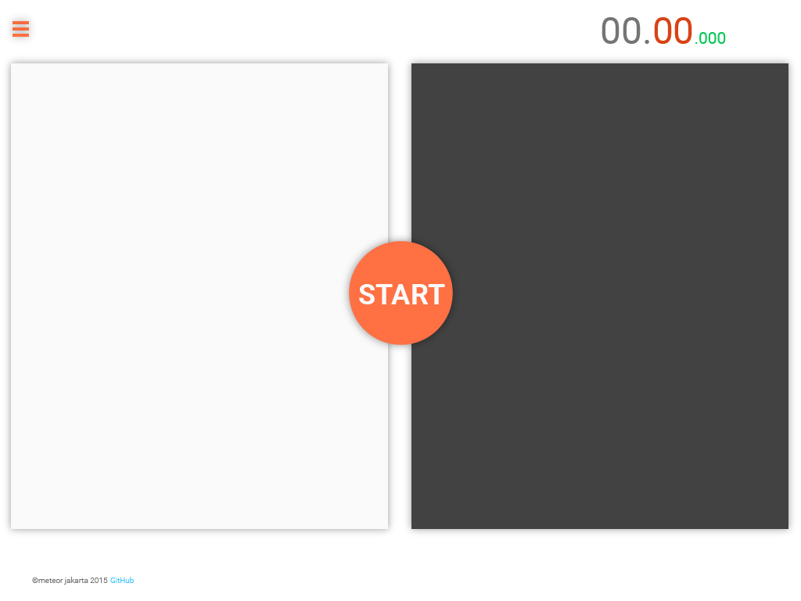
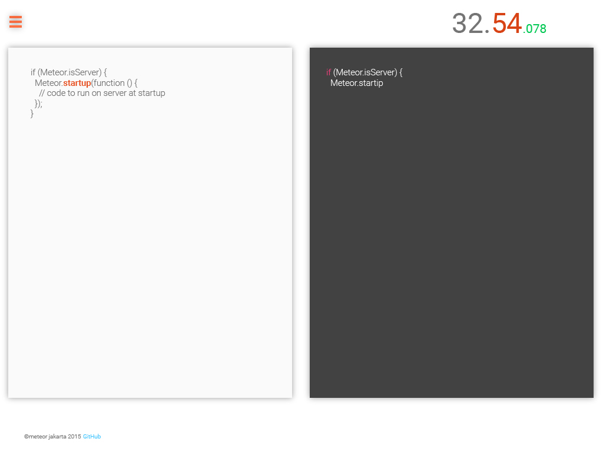

#Branch Info
Keyboardhero play area structure, without modal, without animation
using [BOURBON](https://github.com/thoughtbot/bourbon), [NEAT](https://github.com/thoughtbot/neat), [BITTERS](https://github.com/thoughtbot/bitters)

# keyboardhero

For more info please visit [Master](https://github.com/meteor-jakarta/keyboardhero)

## Wireframe mock-up

## Future Feature
1. Duel Mode
